## Build Azure Fucntion Module for Edge

### Install .NET Core

To create Azure Functions locally using Visual Studio Code you will need .NET Core. Complete the following steps to install .NET Core.

1. Open a browser and navigate to [.NET Downloads](https://dotnet.microsoft.com/download).

2. Select the **Windows** tab and click **Download .NET Core SDK**

    **Note**: We are using .NET Core **not** .NET Framework.

    Once the download has completed, continue.

3. Launch the downloaded Microsoft .NET Core installer and click **Install**.

    When the **User Access Control** prompt is displayed, click **Yes**.

4. Once the installation has completed, click **Close**.

5. Open a **Command prompt** and enter the following command:

    ```script
    dotnet --version
    ```

    You should see a response similar to:

    ```script
    C:\>dotnet --version
    2.2.100

    C:\>
    ```

    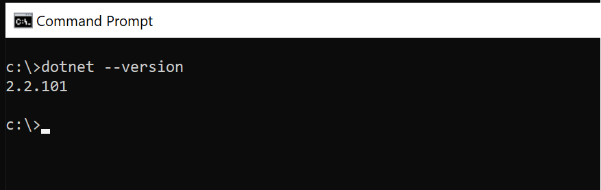


#### Download Docker

Go To [Docker](https://docs.docker.com/install/) to Install Docker for Windows or Mac. 


#### Verify Installation


1. In the **Command Prompt** window, enter the following:

    ```command
    docker --version
    ```

    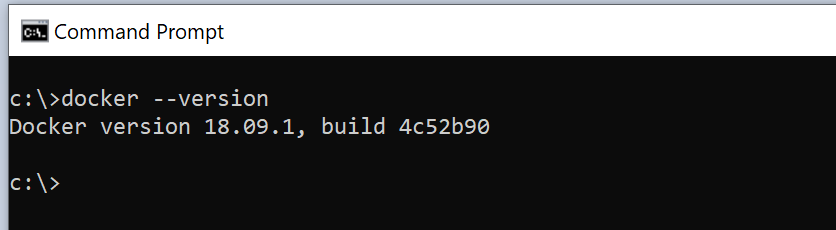

### Create Azure Container Registry

In this section, we are going to use the Azure Portal to create a Azure Container Registry (ACR).

1. Open a browser and navigate to [Azure Portal](https://portal.azure.com)

2. Click on **Create a Resource** -> **Containers** -> **Container Registry**

    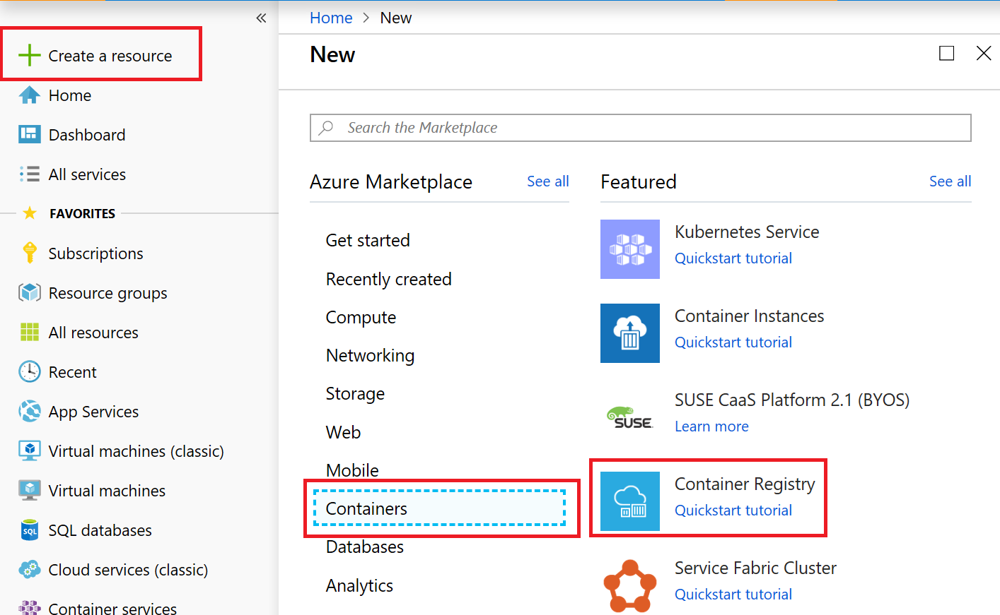

3. Provide a unique name to your container registry, enable admin user and click **Create**

    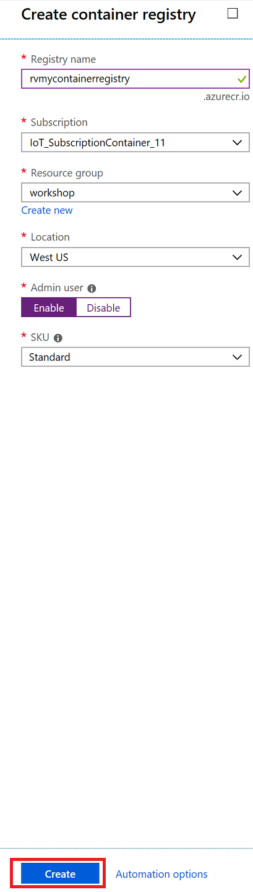

4. Once your registry is created go to resource for details

    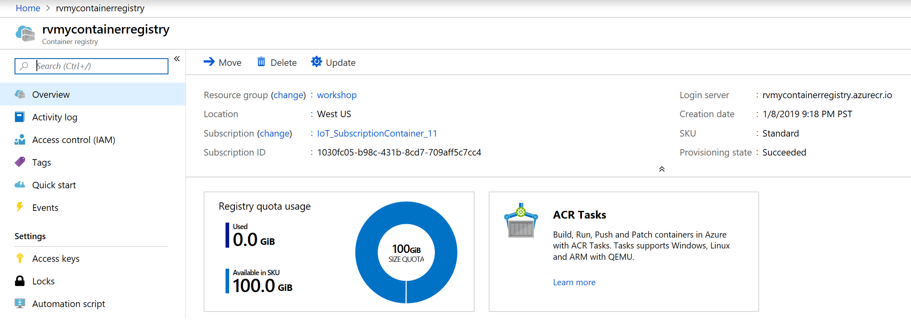


### Create a Function Project

The Azure IoT Edge extension for Visual Studio Code that you installed provides management capabilities as well as some code templates. You will use Visual Studio Code to create an IoT Edge solution that contains an Azure function.

1. In Visual Studio Code, open the Command Palette by pressing **CONTROL + SHIFT + P** and enter **Azure IoT Edge: New**.

    Choose **Azure IoT Edge: New IoT Edge Solution**.

    

2. A **Choose Folder** window will open, choose the location where you wish to create the solution.

3. In Visual Studio Code, under **Provide a Solution Name**, enter **EdgeFunction**.

    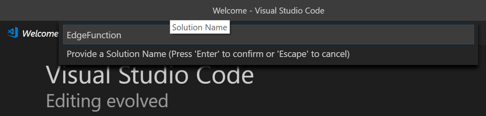

4. Under **Select Module Template**, select **Azure Functions - C#**.

    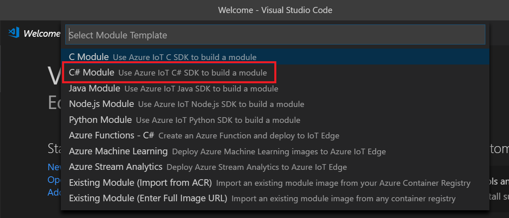

5. Under **Provide a Module Name**, enter **FilterFunction**.

    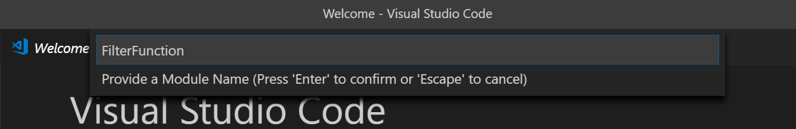

6. Under **Provide Docker image repository for the module**, replace the value with the following:

    ```shell
    [registry name].azurecr.io/filterfunction
    ```

    Replace `[registry name]` with the registry name you created earlier. 

    **Note**: the repository name must be lowercase

    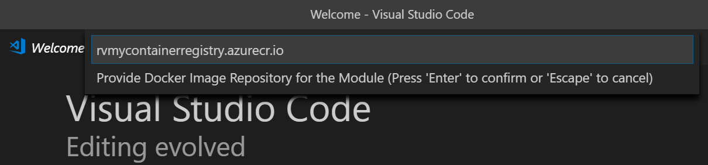

7. New VS Code Window will be opened.

    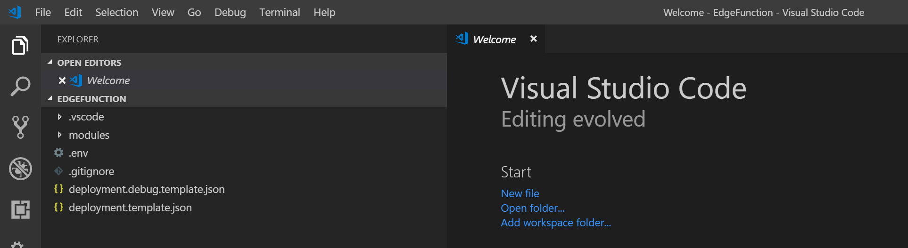

8. You will be prompted to set container registry crendetials. Click **Yes**

    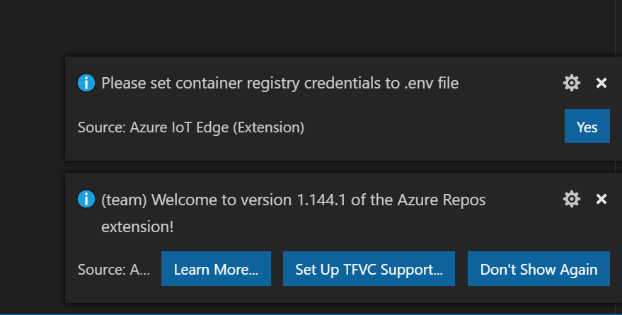

9. Opens a env file where you can set the credentials

    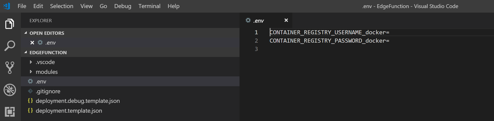

10. Opens a env file where you can set the credentials

    

11. Get the credentials from the portal. Go to Container Registry you created and click on **Access Keys**. Pick the username and password. In the image below the username and password have been gerayed out. 

    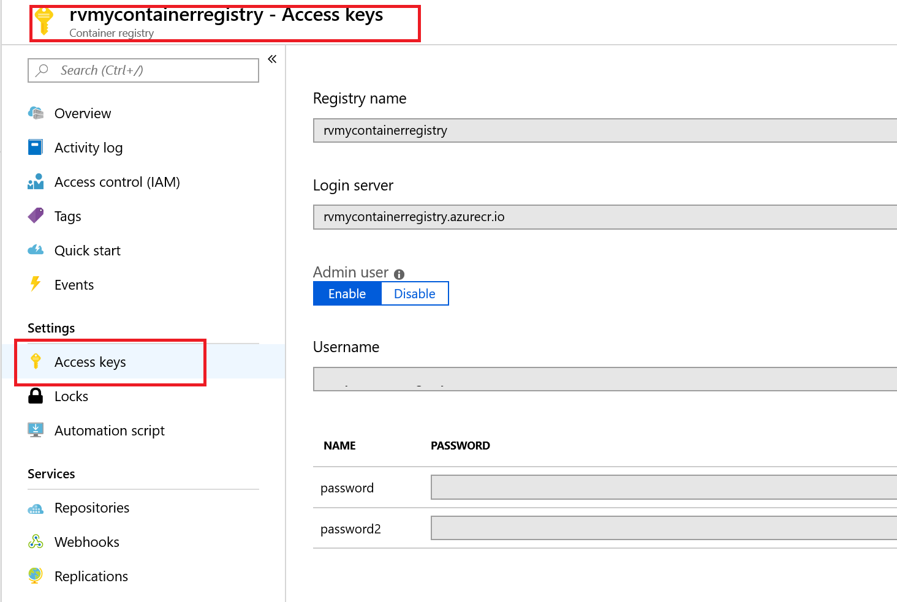


11. Replace the contents of the **FilterFunction.cs** file with the following code. Temperature Threshhold has been set to 20. When machine.temparature goes above threshhold message is output

    ```csharp
    using System;
    using System.Collections.Generic;
    using System.IO;
    using System.Text;
    using System.Threading.Tasks;
    using Microsoft.Azure.Devices.Client;
    using Microsoft.Azure.WebJobs;
    using Microsoft.Azure.WebJobs.Extensions.EdgeHub;
    using Microsoft.Azure.WebJobs.Host;
    using Microsoft.Extensions.Logging;
    using Newtonsoft.Json;

    namespace Functions.Samples
    {
        public static class FilterFunction
        {
            [FunctionName("FilterFunction")]
            public static async Task FilterMessageAndSendMessage(
                [EdgeHubTrigger("input1")] Message messageReceived,
                [EdgeHub(OutputName = "output1")] IAsyncCollector<Message> output,
                ILogger logger)
            {
                const int temperatureThreshold = 20;
                byte[] messageBytes = messageReceived.GetBytes();
                var messageString = System.Text.Encoding.UTF8.GetString(messageBytes);

                if (!string.IsNullOrEmpty(messageString))
                {
                    logger.LogInformation("Info: Received one non-empty message");
                    // Get the body of the message and deserialize it.
                    var messageBody = JsonConvert.DeserializeObject<MessageBody>(messageString);

                    if (messageBody != null && messageBody.machine.temperature > temperatureThreshold)
                    {
                        // Send the message to the output as the temperature value is greater than the threshold.
                        var filteredMessage = new Message(messageBytes);
                        // Copy the properties of the original message into the new Message object.
                        foreach (KeyValuePair<string, string> prop in messageReceived.Properties)
                        {filteredMessage.Properties.Add(prop.Key, prop.Value);}
                        // Add a new property to the message to indicate it is an alert.
                        filteredMessage.Properties.Add("MessageType", "Alert");
                        // Send the message.
                        await output.AddAsync(filteredMessage);
                        logger.LogInformation("Info: Received and transferred a message with temperature above the threshold");
                    }
                }
            }
        }
        //Define the expected schema for the body of incoming messages.
        class MessageBody
        {
            public Machine machine {get; set;}
            public Ambient ambient {get; set;}
            public string timeCreated {get; set;}
        }
        class Machine
        {
            public double temperature {get; set;}
            public double pressure {get; set;}
        }
        class Ambient
        {
            public double temperature {get; set;}
            public int humidity {get; set;}
        }
    }   
    ```

11. Save the changes to the of the **FilterFunction.cs** file.

12. If your project shows error do a **dotnet restore**. Open a terminal and go to your project modules folder and type in **dotnet restore**. Once done close the FilterFunction.cs file and reopen. 

    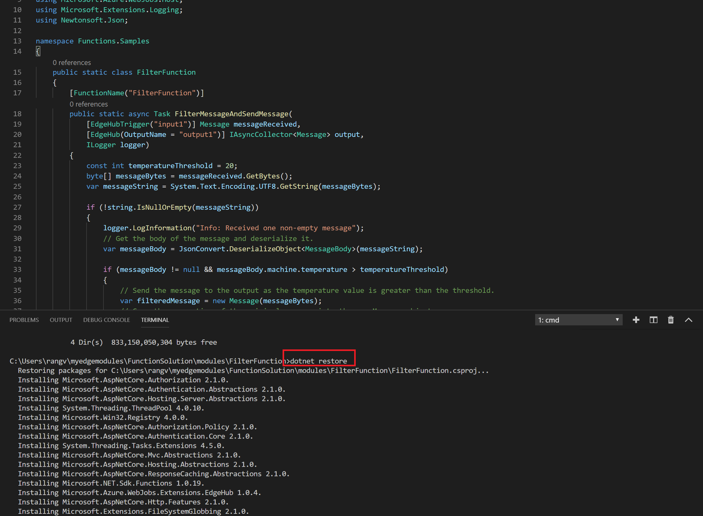

13. Open the VS Code integrated terminal by selecting View > Terminal.

14. Sign in to your container registry by entering the following command in the integrated terminal. 

    Use the username and login server that you copied from your Azure container registry earlier.

    ```shell
    docker login -u <ACR username> <ACR login server>
    ```

    When you are prompted for the password, paste the password for your container registry and press Enter.

    ```shell
    Password: <paste in the ACR password and press enter>
    Login Succeeded
    ```

    Hit **ENTER** to submit the password.

15. In the VS Code explorer, open the **deployment.template.json** file in your IoT Edge solution workspace.

    This file tells the IoT Edge runtime which modules to deploy to a device. Notice that your Function module, **FilterFunction** is listed along with the **tempsensor** module we deployed in an earlier task, that provides test data.

    If you scroll down to line 87, you will see a definition for the routes on the IoTEdge module:

    ```json 
    {
        "routes": {
        "telemetryToCloud": "FROM /messages/modules/tempsensor/* INTO $upstream",
        "FilterFunctionToIoTHub": "FROM /messages/modules/FilterFunction/outputs/* INTO $upstream",
        "sensorToFilterFunction": "FROM /messages/modules/tempsensor/outputs/temperatureOutput INTO BrokeredEndpoint(\"/modules/FilterFunction/inputs/input1\")"
        }
    }
    ```
    
    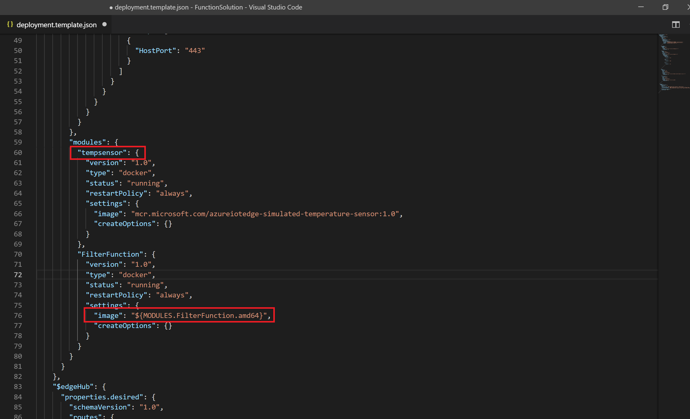

    This replaces the existing route which takes the output of the **tempsensor** module and sends it to **\$upstream** (which is the IoT Hub in the cloud). The new routes take the output of **tempsensor** and routes it to the **FilterFunction** and then takes the output from **FilterFunction** and routes it to **$upstream** .

    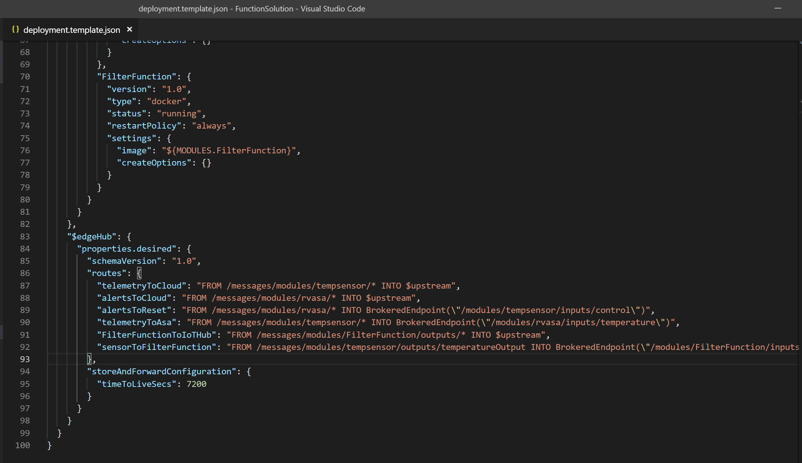

    Also change the tempsensor module name from tempSensor to tempsensor. It is case sensitive.

16. Open the **.env** file in your IoT Edge solution workspace. 

    This git-ignored file stores your container registry credentials so that you don't have to put them in the deployment manifest template. Provide the username and password for your container registry.

17. In the **.env** file, provide the username and password for the Azure Container Registry.

18. Save the changes to the **.env** file.

19. In the VS Code explorer, right-click the **deployment.template.json** file and select **Build and Push IoT Edge solution**.

    When you tell Visual Studio Code to build your solution, it first takes the information in the deployment template and generates a deployment.json file in a new folder named config. Then it runs two commands in the integrated terminal: docker build and docker push. These two commands build your code, containerize the functions, and then push the code to the container registry that you specified when you initialized the solution.

    You will see a lot of output generated during the process.

    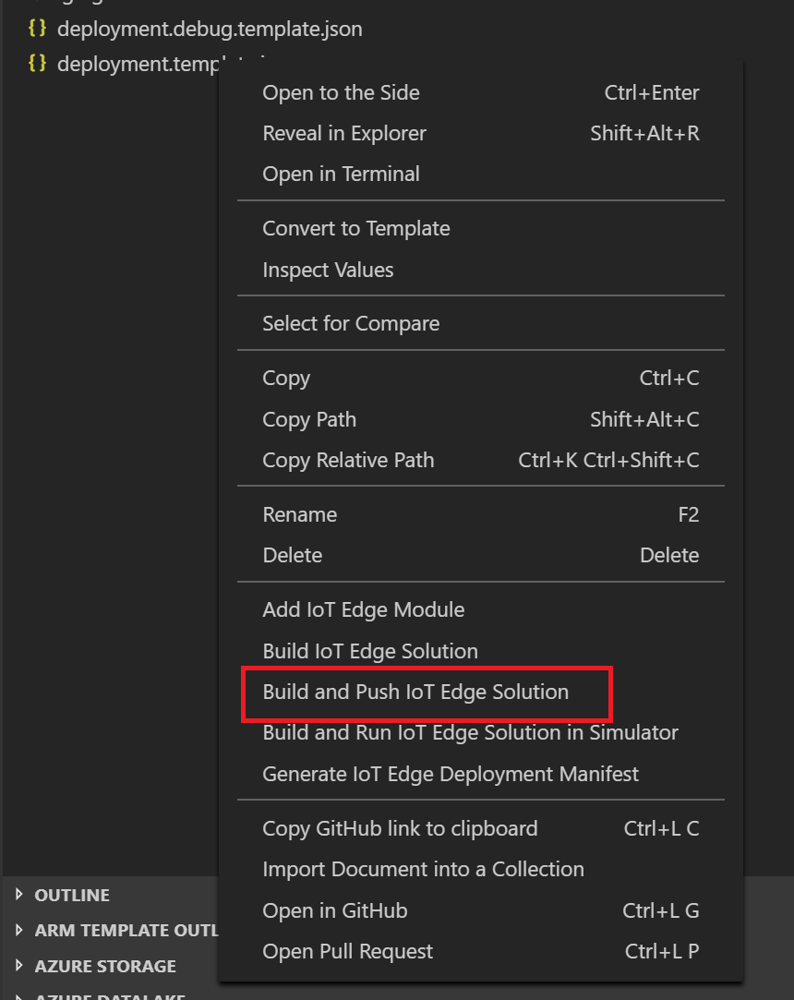

### View your Container Image

Visual Studio Code outputs a success message when your container image is pushed to your container registry. If you want to confirm the successful operation for yourself, you can view the image in the registry.

1. In a browser, open the Azure Portal [https://portal.azure.com](https://portal.azure.com).

    Login using your Azure Subscription if required.

2. In the **Search resources, services, and docs**, enter the name of the ACR  you created earlier, and then select it from the displayed list.

3. In the left hand nav area of the **Container registry** blade, under **Services**, click **Repositories**.

    You should see the **filterfunction** repository in the list.

4. In the list of repositories, click **filterfunction**.

    The **Repository** blade will open. In the Tags section, you should see the **0.0.1-amd64** tag. This tag indicates the version and platform of the image that you built. These values are set in the **module.json** file in the FilterFunction folder.


    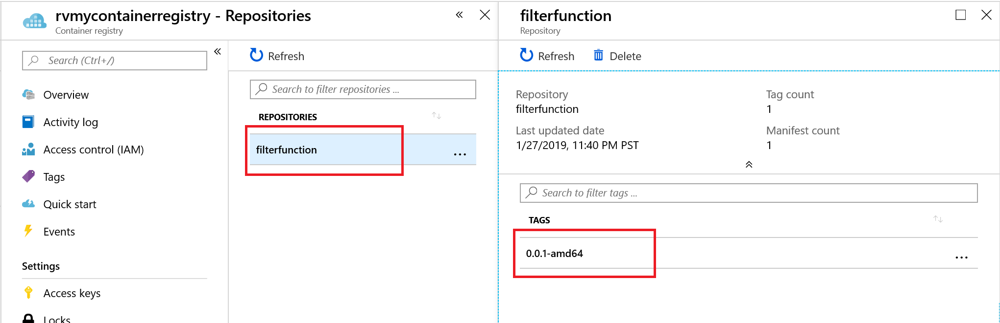

### Deploy and Run the Solution

You can use the Azure portal to deploy your function module to an IoT Edge device like you did in the quickstarts. You can also deploy and monitor modules from within Visual Studio Code. The following sections use the Azure IoT Edge extension for VS Code that was listed in the prerequisites. Install the extension now, if you didn't already.

1. In Visual Studio Code, open the Command Palette by pressing **CONTROL + SHIFT + P** and enter **Azure IoT Hub: Select IoT Hub**.

2. Select the subscription that has your IoT hub.

3. Select the IoT hub that you want to access.

4. In the VS Code explorer, expand the Azure IoT Hub Devices section.

    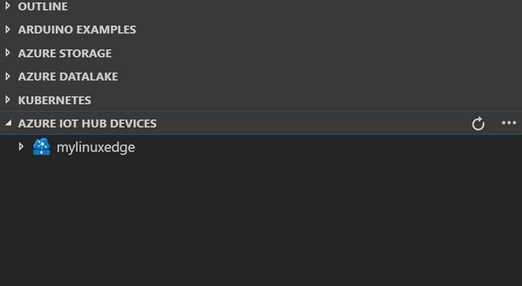


5. Right-click the name of your IoT Edge device, and then click **Create Deployment for single device**.

6. In the **Open** dialog, browse to the solution folder that contains the FilterFunction. 

7. Open the **config** folder, select the **deployment.amd64.json** file and then click **Select Edge Deployment Manifest**.

    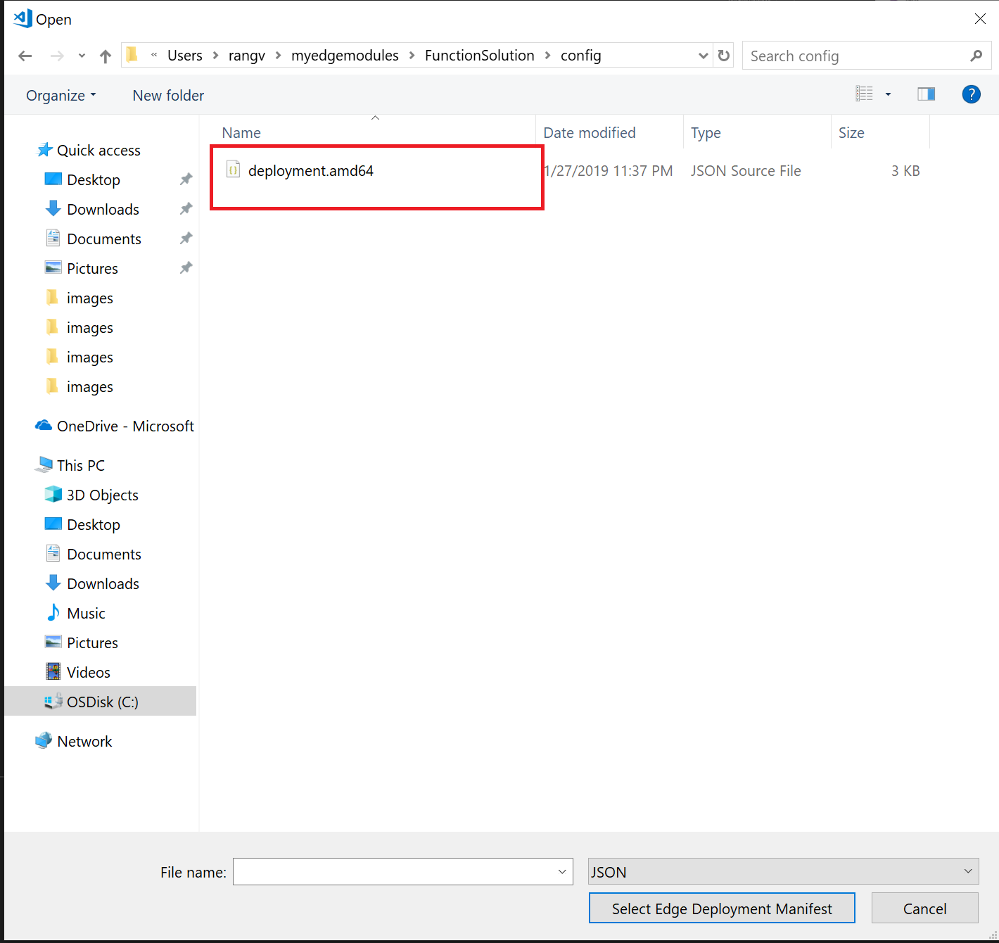

    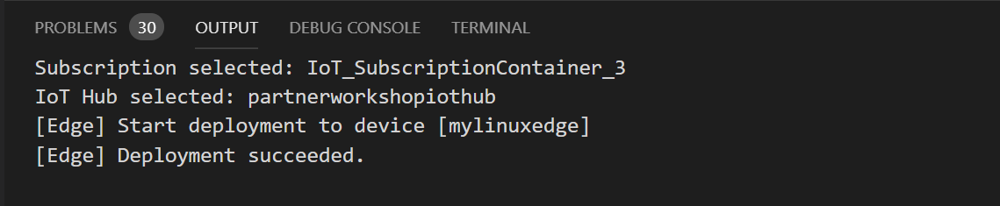


8. Refresh the **Azure IoT Hub Devices** section. You should see the new `FilterFunction` running along with the `tempsensor` module and the `$edgeAgent` and `$edgeHub`.

    It may take a few moments for the new modules to show up. Your IoT Edge device has to retrieve its new deployment information from IoT Hub, start the new containers, and then report the status back to IoT Hub.

    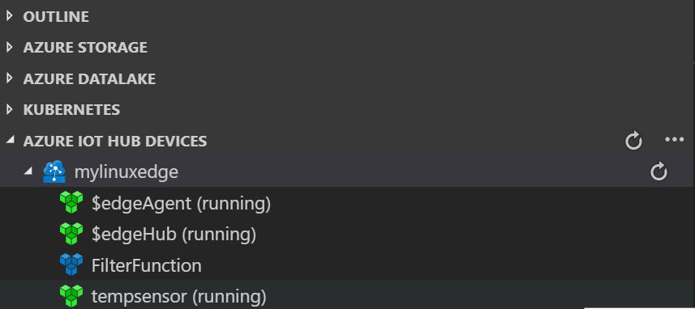

    Once the deployment completes you will see the following view

    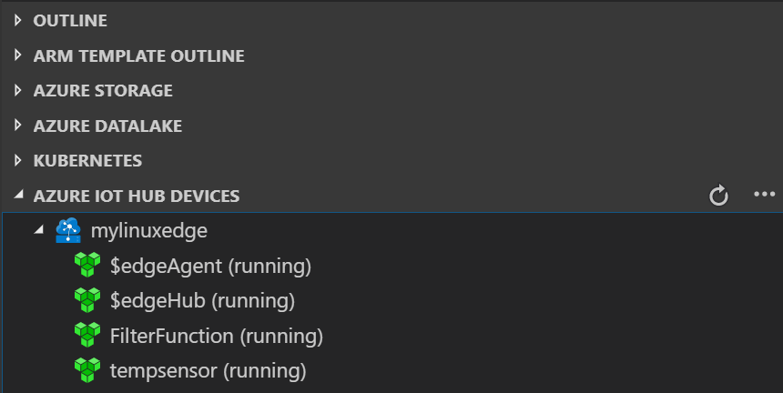

    On the portal

    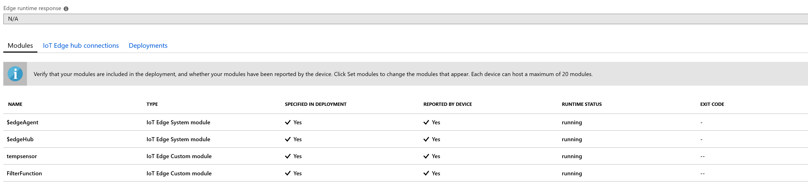

    On Linux VM

    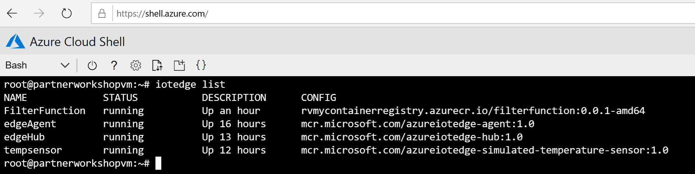


9.  To see all of the messages that arrive at your IoT hub, open the Command Palette by pressing **CONTROL + SHIFT + P** and enter **Azure IoT Hub: Start Monitoring D2C Message**.

10. To filter the view to see all of the messages that arrive at your IoT hub from a specific device, right-click the device in the Azure IoT Hub Devices section and select **Start Monitoring D2C Messages**.

11. To stop monitoring messages, open the Command Palette by pressing **CONTROL + SHIFT + P** and enter **Azure IoT Hub: Stop monitoring D2C message**.
