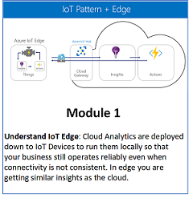
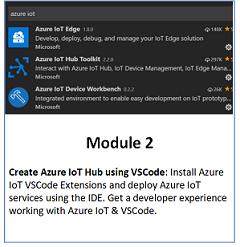
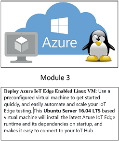
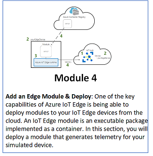
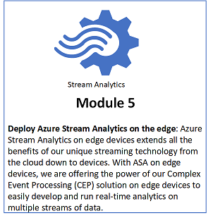
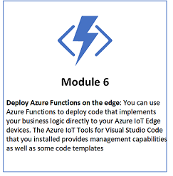

# Azure IoT Edge Hands On Labs With Edge Enabled MarketPlace VM

## Overview

Azure IoT Edge is a fully managed service that delivers cloud intelligence locally by deploying and running

* Artificial Intelligence (AI)
* Azure Services
  * Azure Stream Analytics
  * Azure Functions
  * Azure Machine Learning
  * Azure Cognitive Services
  * Azure Event Grid
* Custom Logic
  
directly on cross-platform IoT devices. Run your IoT solution securely and at scale—whether in the cloud or offline.

This hands-on lab demonstrates what is involved in standing up an Azure IoT Edge enabled Linux VM on Azure Marketplace and running Edge Modules.

In this workshop you will:

* Create an Azure IoT Edge Linux VM from Azure Market Place

## Modules

](pattern)&nbsp;&nbsp;&nbsp;&nbsp;&nbsp;&nbsp;&nbsp;&nbsp;&nbsp;&nbsp;&nbsp;&nbsp;&nbsp;&nbsp;

](edgemodule)&nbsp;&nbsp;&nbsp;&nbsp;&nbsp;&nbsp;&nbsp;](streamanalytics)&nbsp;&nbsp;&nbsp;&nbsp;&nbsp;&nbsp;&nbsp;](functionmodule)&nbsp;&nbsp;&nbsp;&nbsp;&nbsp;&nbsp;&nbsp;

* [Module 1 - Learn About IoT Edge Pattern](pattern)
* [Module 2 - Create IoT HuB using VSCode](iothub)
* [Module 3 - Deploy Azure IoT Edge Enabled Linux VM](marketplacedeployment)
* [Module 4 - Add an Edge Module and Deploy](edgemodule)
* [Module 5 - Deploy Azure Stream Analytics on Edge](streamanalytics)
* [Module 6 - Deploy Azure Function on Edge](functionmodule)

## Useful Resources

* [Azure IoT Reference Architecture](http://download.microsoft.com/download/A/4/D/A4DAD253-BC21-41D3-B9D9-87D2AE6F0719/Microsoft_Azure_IoT_Reference_Architecture.pdf
), The reference architecture provides guidance for building secure and scalable, device-centric solutions for connecting devices, conducting analysis, and integrating with back-end systems.
